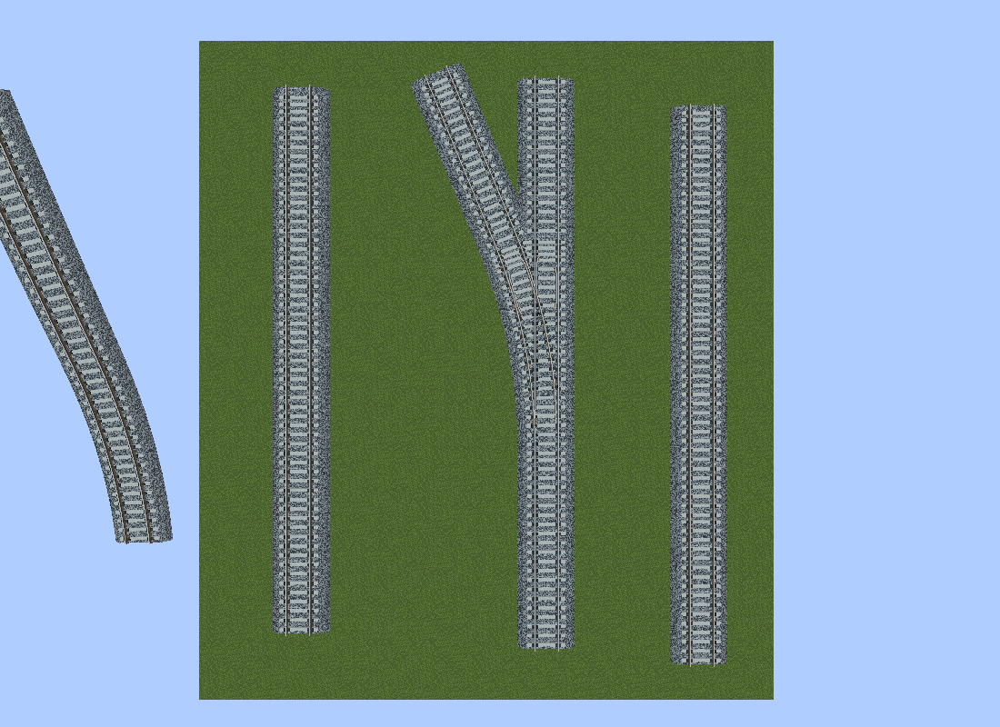
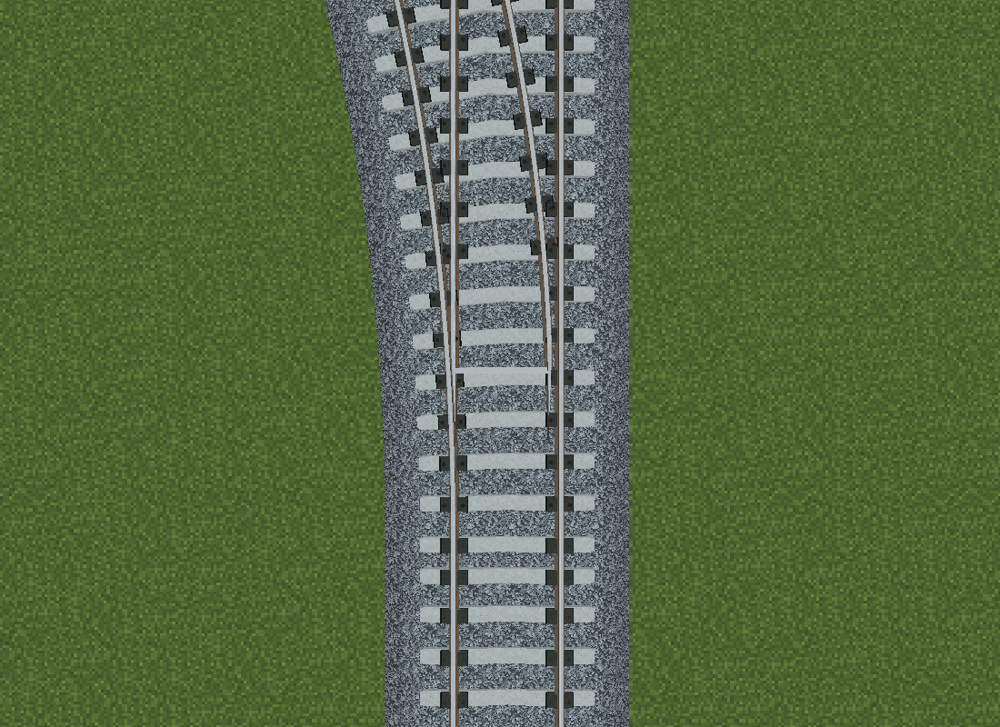
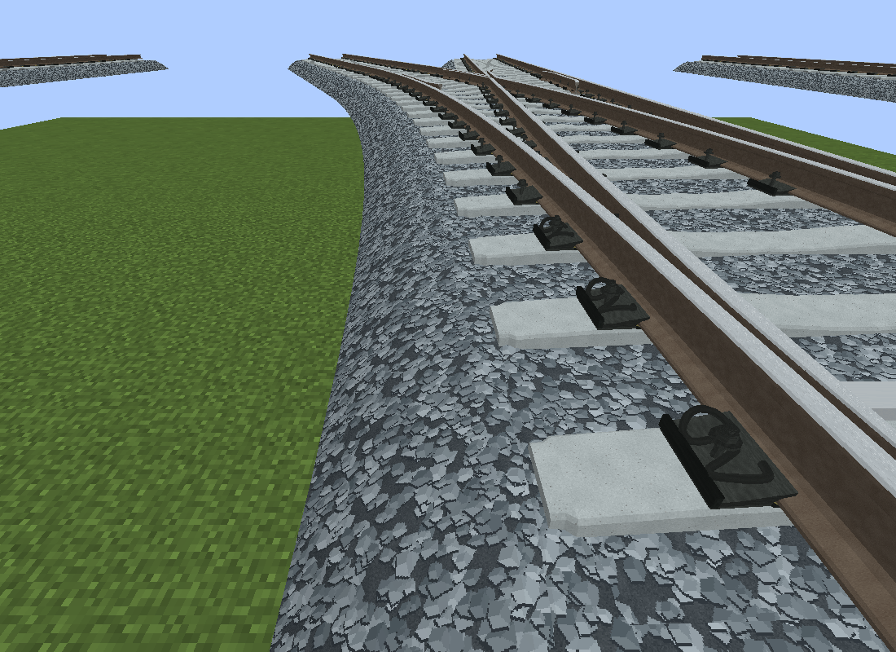

# Citizons Railway

面向 Minecraft 1.20.1 / Forge 47.4.18 / MTR 4.0.3 的 1435 mm 实体轨道资源包，与 [MTR Railway Point Advanced](https://github.com/CitiZons/MTR_Railway_Point_Advanced) 配套。

提供中央下凹混凝土轨枕、双回环弹条扣件、146 × 210 mm 完整压板、磨耗轨顶和最大厚度 0.35 m 的弧坡梯形道砟。普通轨道与道岔复用模型分组和纹理；钢轨与道砟共享连续截面和倾斜轴。轨距为 1.435 m，轨面高度为 0.26428 m。

## 安装

1. 将 [dist/Citizons_Railway.zip](dist/Citizons_Railway.zip) 放入游戏实例的 `resourcepacks` 并启用，或使用 `resourcepacks/Citizons_Railway` 文件夹。
2. 使用配套 Mod 仓库中包含本次资源模型支持的 0.1.2 构建；旧版同版本号 JAR 不一定包含这些修复。普通轨道与道岔一致的材质、连续坡面、枕木接缝调整和自动细节切换需要更新后的客户端。
3. 选择 `Citizons 1435mm` 样式。曾手动锁定其他道岔轨型时，在编辑器中改回自动或 Citizons 样式；不要同时安装多份 Point Advanced JAR。

4 m 内使用完整扣件，4–12 m 使用简化扣件，12 m 外保留低细节轮廓，无需手动切换样式。三档完整单元面数为 4600 / 1176 / 756；单独启用资源包时，MTR 使用入口中的高细节 OBJ。

## 源码与再生成

- `resourcepacks/Citizons_Railway/`：可直接安装的包目录，包含模型、纹理、样式和轨型描述。
- `generate_citizons_railway.py`：确定性模型与纹理生成器。
- `railway_resource_checks/validate.py`：检查实际导出尺寸、法线、闭合端面、UV、材质引用与重复生成一致性。
- `railway_resource_checks/render.py`：Blender 模型预览脚本。
- `railway_resource_checks/output/`：静态检查摘要、隔离游戏测试摘要和选定截图。

在仓库根目录执行：

```powershell
python -m pip install numpy Pillow
python generate_citizons_railway.py
python railway_resource_checks/validate.py
Compress-Archive -Path resourcepacks/Citizons_Railway/* -DestinationPath dist/Citizons_Railway.zip -Force
```

模型预览可通过 `blender --background --python railway_resource_checks/render.py` 生成。包内 [README](resourcepacks/Citizons_Railway/README.md) 与 [模型参数](resourcepacks/Citizons_Railway/MODEL_NOTES.md) 说明分组角色、坐标和新增钢轨系列的方式。新增系列沿用相同结构并提供独立样式描述即可，无需包名白名单或修改握手协议。

## 验证记录

本次 MTR + Optional Rail、仅 MTR 两种隔离运行均通过资源材质、旋转轴、道岔接管、枕木接缝、资源重载与渲染缓存检查。坡度／倾角变化的 4155 / 4170 个端面点最大接缝均为 0；外侧基本轨扣件位置检查覆盖 128 个承座。静止 33 帧中自定义几何重建与 PointGpu 上传均为 0，未进行对比 FPS 基准。

[integration.json](railway_resource_checks/output/integration.json) 保存通过标记与机位信息；其中 `../MTR_Railway_Point_Advanced/build/...` 指向原始测试的同级 Mod 构建目录，日志和 JAR 不包含在本资源包仓库中。对应 Mod 的回归测试可通过同级仓库布局找到本包，或用 `CITIZONS_RAILWAY_PACK` 指向包目录；游戏探针可用 `-RailPackZip` 指定本仓库的 ZIP。

### 零倾角道岔俯视



### 入口扣件与最外侧基本轨




