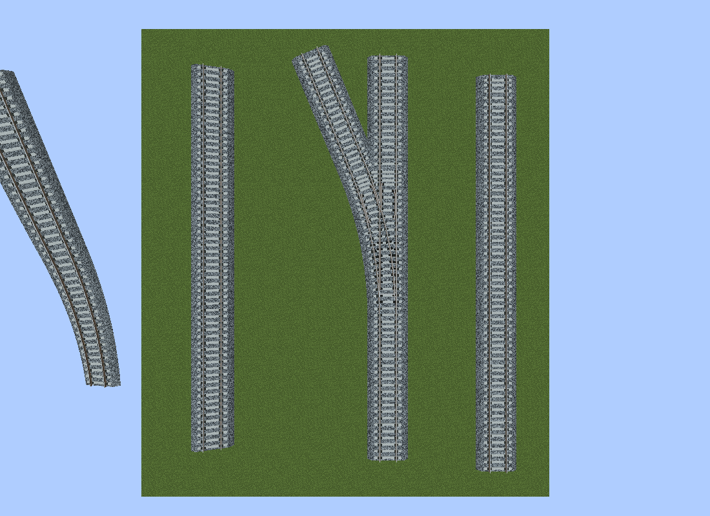
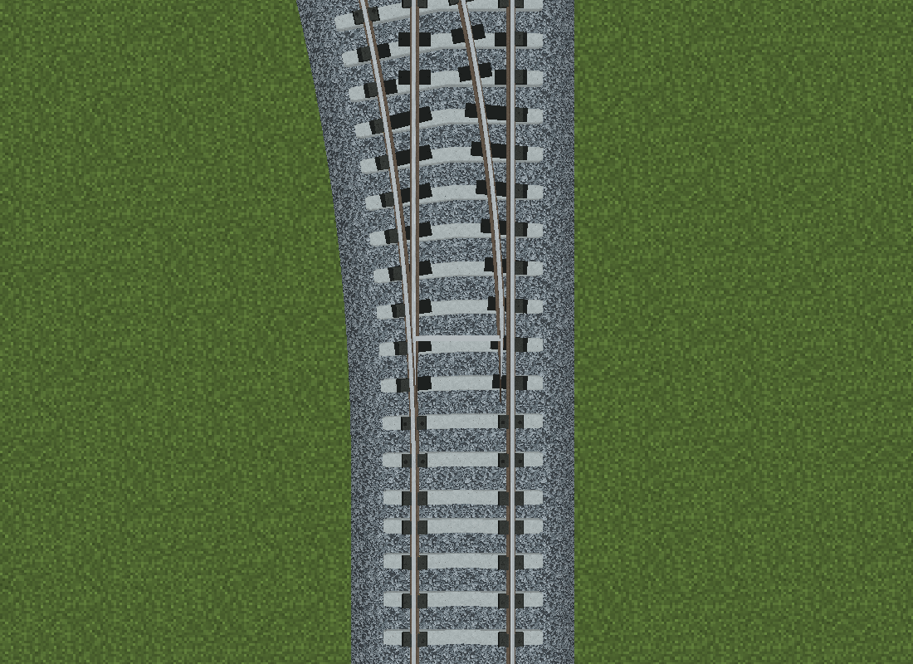
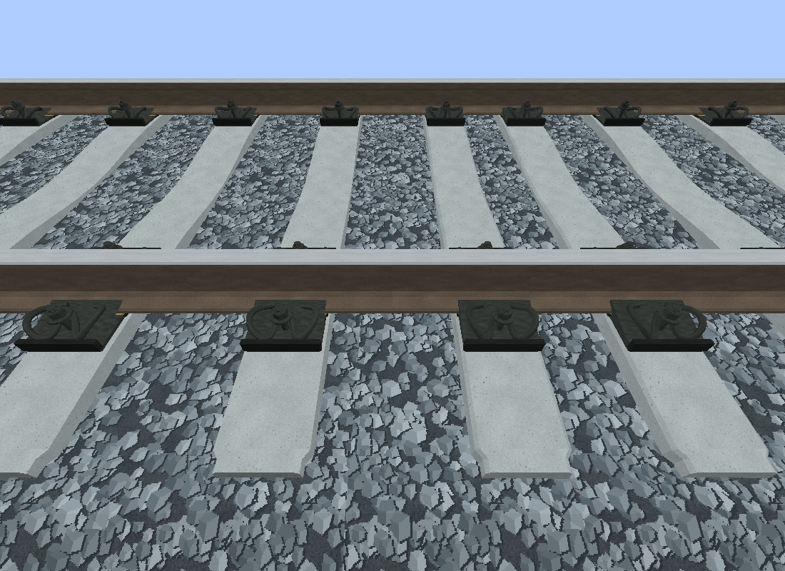
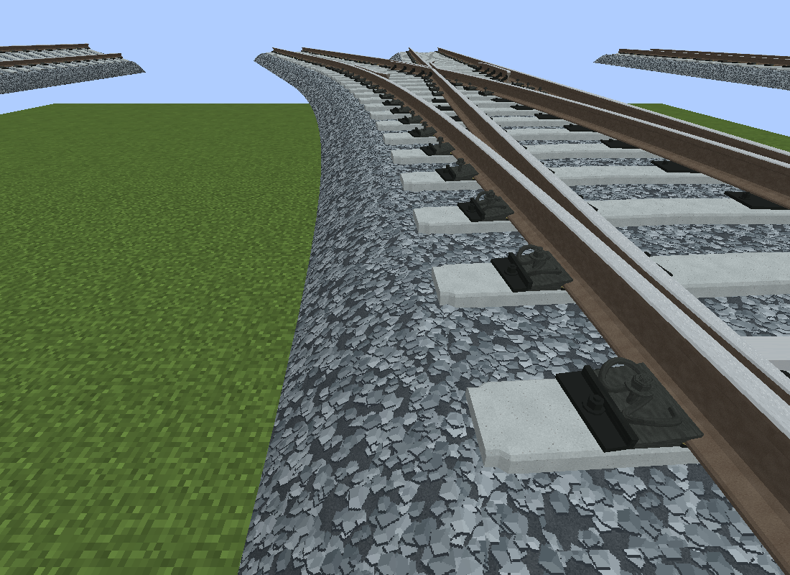
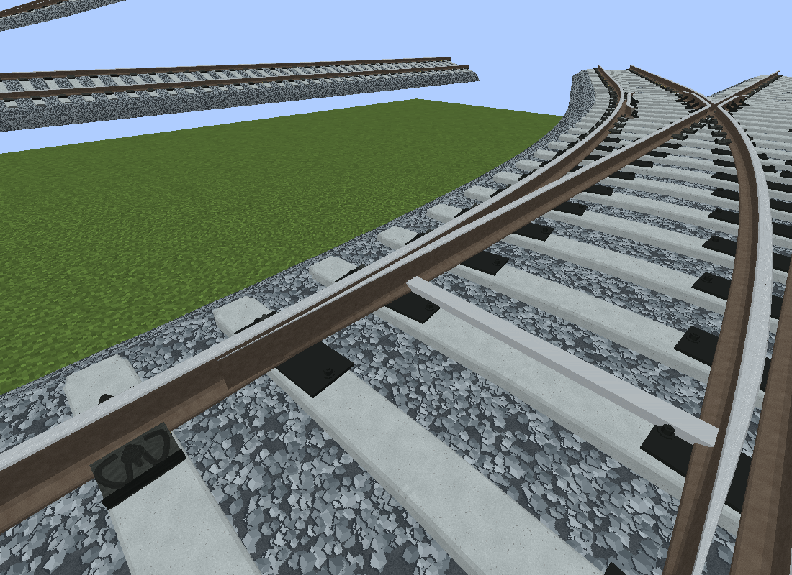
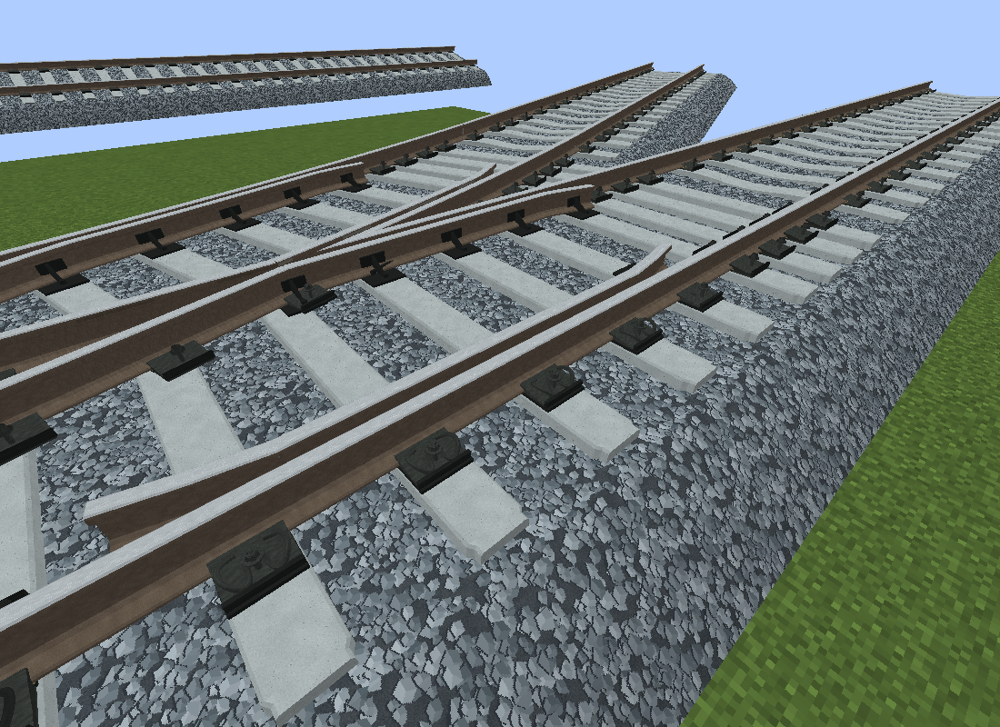
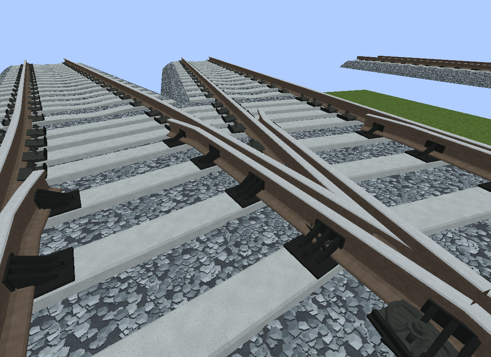
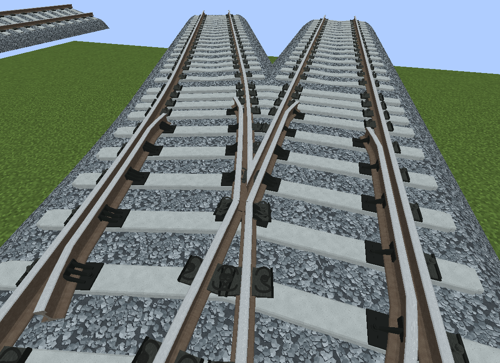

# Citizons Railway

面向 Minecraft 1.20.1 / Forge 47.4.18 / MTR 4.0.3 的 1435 mm 实体轨道资源包，与 [MTR Railway Point Advanced](https://github.com/CitiZons/MTR_Railway_Point_Advanced) 配套。

提供中央下凹混凝土轨枕、双回环弹条扣件、146 × 210 mm 完整压板、磨耗轨顶和最大厚度 0.35 m 的弧坡梯形道砟。普通轨道与道岔复用模型分组和纹理；钢轨与道砟共享连续截面和倾斜轴。轨距为 1.435 m，轨面高度为 0.26428 m。

## 当前版本与配套更新

当前版本为 `0.1.1`，与 MTR Railway Point Advanced `0.1.4` 配套。包内 `VERSION` 是发布版本的唯一来源，资源包列表描述和带版本 ZIP 由打包脚本同步生成。Minecraft 的 `pack_format: 15` 是资源格式版本，与发布版本独立。

本次发布新增 `Citizons 高仿真钢轨(外护轨) 1435mm` 与 `Citizons 高仿真钢轨(中央护轨) 1435mm` 样式，普通样式保持不变。Point Advanced `0.1.4` 负责连续护轨、独立端头和道岔模板切换，并沿用平顶多轨岔枕、固定滑床板、岔心共用底板及护轨／翼轨共用承座。普通轨枕仍保留中央下凹。见 [CHANGELOG.md](CHANGELOG.md)。

## 安装

1. 将 [dist/Citizons_Railway-0.1.1.zip](dist/Citizons_Railway-0.1.1.zip) 放入游戏实例的 `resourcepacks` 并启用；兼容文件名 `dist/Citizons_Railway.zip` 内容完全相同。开发时也可直接使用 `resourcepacks/Citizons_Railway-0.1.1` 文件夹。
2. 安装 MTR Railway Point Advanced `0.1.4`。普通轨道与道岔一致的材质、连续坡面、枕木接缝调整、翼轨承座、护轨端头和自动细节切换需要该版本客户端。
3. 选择 `Citizons 高仿真钢轨1435mm` 样式。曾手动锁定其他道岔轨型时，在编辑器中改回自动或 Citizons 样式；不要同时安装多份 Point Advanced JAR。

4 m 内使用完整扣件，4–12 m 使用简化扣件，12 m 外保留低细节轮廓，无需手动切换样式。三档完整单元面数为 4600 / 1176 / 756；单独启用资源包时，MTR 使用入口中的高细节 OBJ。

## 源码与再生成

整理架构：模型、纹理、生成器、验证脚本与发布包统一维护在 `MTR_Citizons_Railway` 子项目内。下列路径均相对于本仓库根目录。

- `resourcepacks/Citizons_Railway/`：可直接安装的包目录，包含模型、纹理、样式和轨型描述。
- `resourcepacks/Citizons_Railway/VERSION`：资源包发布版本的唯一来源。
- `generate_citizons_railway.py`：确定性模型与纹理生成器。
- `package_release.py`：同步资源包描述并生成可重复构建的版本 ZIP 和兼容 ZIP。
- `railway_resource_checks/validate.py`：检查实际导出尺寸、法线、闭合端面、UV、材质引用与重复生成一致性。
- `railway_resource_checks/render.py`：Blender 模型预览脚本。
- `railway_resource_checks/output/`：静态检查摘要、隔离游戏测试摘要和选定截图。

在仓库根目录执行：

```powershell
python -m pip install numpy Pillow
python generate_citizons_railway.py
python railway_resource_checks/validate.py
python package_release.py
```

每次构建完成后，将带版本 ZIP 解压并保留到 `resourcepacks/Citizons_Railway-0.1.1`，后续构建更新对应版本文件夹；`resourcepacks/Citizons_Railway` 是生成器使用的源目录。文件夹根目录包含 `pack.mcmeta` 和 `assets`，可以直接复制到游戏实例的 `resourcepacks` 并启用；`dist` 中的 ZIP 作为额外发布文件保留。

模型预览可通过 `blender --background --python railway_resource_checks/render.py` 生成。包内 [README](resourcepacks/Citizons_Railway/README.md) 与 [模型参数](resourcepacks/Citizons_Railway/MODEL_NOTES.md) 说明分组角色、坐标和新增钢轨系列的方式。新增系列沿用相同结构并提供独立样式描述即可，无需包名白名单或修改握手协议。

## 验证记录

配套 Mod `0.1.3` 的支撑更新已通过完整构建、翼轨专项回归及 MTR + Optional Rail 隔离运行；静止 64 帧内几何重建和上传均为 0，9 组最终世界非支撑几何与基线一致。支撑初版也通过仅 MTR 环境；最终翼轨补齐版本未另行复跑仅 MTR。详情见配套 Mod 的 `VALIDATION.md`。以下运行摘要保留此前资源包验证记录；文末实机截图已更新为包含翼轨承座修复的实现，与 `0.1.3` 发布版几何一致。

此前 MTR + Optional Rail、仅 MTR 两种隔离运行均通过资源材质、旋转轴、道岔接管、枕木接缝、资源重载与渲染缓存检查。坡度／倾角变化的 4155 / 4170 个端面点最大接缝均为 0；外侧基本轨扣件位置检查覆盖 128 个承座。静止 33 帧中自定义几何重建与 PointGpu 上传均为 0，未进行对比 FPS 基准。

[integration.json](railway_resource_checks/output/integration.json) 保存通过标记与机位信息；其中 `../MTR_Railway_Point_Advanced/build/...` 指向原始测试的同级 Mod 构建目录，日志和 JAR 不包含在本资源包仓库中。对应 Mod 的回归测试可通过同级仓库布局找到本包，或用 `CITIZONS_RAILWAY_PACK` 指向包目录；游戏探针可用 `-RailPackZip` 指定本仓库的 ZIP。

## 实机效果与扣件特写

以下均为已有隔离游戏截图（Minecraft 1.20.1 / MTR 4.0.3 / Optional Rail）。拍摄于最终翼轨承座修复后、版本号升为 0.1.3 前；几何实现与发布版相同。图片随仓库保存在 `docs/images/`，无需引用本机构建目录。护轨、翼轨支架和滑床板由 Point Advanced 生成。

### 零倾角道岔俯视





### 普通轨道弹条与压板

近距离可见双回环弹条、螺母及完整承压板；远处按距离切换简化细节。



### 外侧基本轨扣件



### 尖轨滑床板

固定滑床板承托活动尖轨，基本轨外侧保留夹持。



### 护轨共用承座

护轨与相邻运行轨共用底板，外侧增加腹板、加强肋和螺栓。



### 翼轨共用承座

翼轨采用与护轨相同的承座结构，并沿各自轨道放置。



### 岔心底板



## 全程护轨

两种护轨均位于运行轨之间。外护轨中心线为 ±0.6285 m，与运行轨的轨头净距为 55 mm，复用道岔钢轨截面、共用底板、外侧弹条夹持、立板、三块三角加强肋和锚栓。中央护轨各向内移动半个轨头宽度（34 mm），中心线为 ±0.356 m，使用独立螺栓压板，枕木取消中央下凹；护轨顶面与侧面使用同一未磨耗钢材纹理。

端头为独立 OBJ：外护轨在 0.4 m 内向中心内收 0.10 m；中央护轨在 1.8 m 内渐收至中心线 ±0.070 m，并以混凝土保护端头收口：顶面由后端轨面高度逐渐降至末端距枕木顶 15 mm，螺栓随斜面降低，所有部件均不高于轨面。`continuousGuard` 描述由本次配套客户端读取，按真实轨段端点放置；相连同型轨段的接缝不重复生成端头。道岔和平交使用该描述的 `turnout` 普通轨道模板，保留完整普通扣件；护轨额外承座随枕木一起调整。

**兼容性：** 自动端头、接续合并和护轨样式的道岔模板切换需要 Point Advanced `0.1.4` 或更新版本；`0.1.3` 不具备这些功能。只装资源包时只有连续直段模型。资源包版本为 `0.1.1`。

中央护轨本次内移后的模型仅做资源几何验证，未重新进游戏验证。
